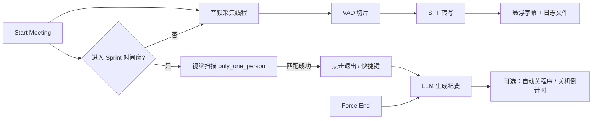

# Teams Auto-Assistant

**Teams 会议全自动记录与智能退出助手** — 在 Windows + Microsoft Teams 环境下，后台实时语音转文字、悬浮字幕展示、视觉识别"只剩一人"后自动挂断，并生成 LLM 结构化会议纪要。

---

## 功能概览

| 功能 | 说明 |
|------|------|
| **实时语音转文字 (STT)** | 会议全程后台录音，低延迟切片 + 静音检测，调用 OpenAI-compatible STT 服务实时转写 |
| **悬浮字幕面板** | 英文玻璃拟态悬浮窗，置顶半透明；打字机效果 + 自动滚动，不遮挡主要工作区 |
| **双音源方案** | 支持 **Stereo Mix 输入设备** 或 **WASAPI Loopback**，按环境二选一，不做混音 |
| **低延迟音频优化** | 自动 mono + 16kHz 重采样，减少 STT 数据量与端到端延迟 |
| **察言观色再退出** | Sprint 时间窗内截屏匹配 `only_one_person` 模板，**确认只剩自己** 才挂断，避免误触 Teams 常驻离开按钮 |
| **智能退出动作** | 优先模板匹配点击红色离开按钮；失败则快捷键兜底（`Alt+Shift+B` / `Ctrl+Shift+H`） |
| **LLM 会议纪要** | 会议结束后自动读取转写日志，生成 Markdown 纪要（Executive Summary / 讨论要点 / 待办事项） |
| **强制结束** | 随时可点 **Force End & Summarize** 跳过视觉检测，手动结束并生成纪要 |
| **会后自动关机（可选）** | 勾选后纪要保存完毕弹出 60 秒倒计时，可取消或立即关机 |
| **OpenAI-compatible** | STT 与 LLM 均通过 `openai` SDK，改 `base_url` / `model` 即可切换硅基流动、DeepSeek 等平台 |

---

## 工作流程



---

## 适用场景

- 跨国 IT 例会、站会、项目同步 — 需要完整转写与结构化纪要
- 深夜/跨时区会议 — 设置 Sprint 时间窗，散会后自动退出并生成纪要，可选自动关机
- 长时间会议 — 后台静默录音转写，悬浮窗实时查看字幕

---

## 快速开始

### 环境要求

- **Windows 10/11**
- **Python 3.10+**（建议 3.11）
- **Microsoft Teams** 桌面客户端
- 支持 OpenAI-compatible API 的 STT / LLM 服务（如 [硅基流动](https://siliconflow.cn/)）

### 安装

```bash
git clone https://github.com/SallyBruce/teams-auto-assistant.git
cd teams-auto-assistant/teams_assistant
pip install -r requirements.txt
```

### 配置 API Key（推荐方式）

```bash
# 复制示例配置，填入真实 Key
copy config.local.yaml.example config.local.yaml   # Windows
# cp config.local.yaml.example config.local.yaml  # macOS/Linux（本项目主要面向 Windows）

# 编辑 config.local.yaml，填写 stt.api_key 与 llm.api_key
python main.py --config config.local.yaml
```

> `config.local.yaml` 已被 `.gitignore` 忽略，不会被提交。仓库中的 `config.yaml` 仅含占位符。

### 准备视觉模板（自动退出必需）

在 `teams_assistant/assets/templates/` 放置截图模板（png/jpg/jpeg）：

| 文件名含 | 用途 |
|----------|------|
| `only_one_person` | **触发模板**：识别"会议只剩我一人"的界面状态（防误挂断关键） |
| `exit_btn` | **退出模板**：红色离开按钮，触发后用于点击挂断 |

建议在与你相同的 **DPI 缩放 / Teams 主题 / 语言** 下截取。可放多张不同分辨率模板，程序内置多尺度匹配（0.8~1.2）。

### 运行

```bash
cd teams_assistant
python main.py --config config.local.yaml
```

**CLI 参数：**

```bash
python main.py --list-devices    # 列出音频输入设备（确认 device_index）
python main.py --self-test       # 最小自测（跨日时间窗逻辑等）
```

---

## 界面说明

启动后为英文悬浮控制面板（CustomTkinter 玻璃拟态风格）：

1. **Transcript** — 实时转写字幕区
2. **Audio Source** — 音源选择（Stereo Mix / WASAPI Loopback）
3. **Sprint Window** — 视觉监控时间段（`HH:MM`，支持跨日如 `23:50 ~ 00:30`）
4. **Shut down PC after summary** — 本场会议结束后是否关机
5. **Start Meeting** — 开始录音转写
6. **Force End & Summarize** — 强制结束并生成纪要

---

## 输出文件

每次 **Start Meeting** 会在 `teams_assistant/` 目录生成：

| 文件 | 内容 |
|------|------|
| `meeting_log_YYYYMMDD_HHMMSS.txt` | 完整转写文本 |
| `Meeting_Summary_YYYYMMDD_HHMMSS.md` | LLM 结构化会议纪要 |

---

## 项目结构

```
teams-auto-assistant/
├── README.md                 # 本文件（GitHub 首页）
├── Teams Auto.md             # 详细产品/技术说明
└── teams_assistant/
    ├── main.py               # 入口
    ├── config.yaml           # 默认配置（占位符 Key）
    ├── config.local.yaml.example
    ├── requirements.txt
    ├── assets/templates/     # 视觉模板（需自行准备）
    ├── core/                 # 音频 / STT / 视觉 / LLM
    └── ui/                   # 悬浮控制面板
```

更完整的架构与配置说明见 [Teams Auto.md](./Teams%20Auto.md) 与 [teams_assistant/README.md](./teams_assistant/README.md)。

---

## 音源选择提示

- **Microphone / Stereo Mix**：通过输入设备录音；若需同时录到远端与同事声音，可启用 Windows「监听此设备」将麦克风播放到扬声器（会有本机回音，录完建议关闭）。
- **WASAPI Loopback**：录制纯系统内声音；需 PyAudio 支持 `as_loopback`，否则请切换 Stereo Mix 方案。
- 运行 `python main.py --list-devices` 确认 `audio.device_index`。

---

## 技术栈

`customtkinter` · `pyaudio` · `openai` · `pyautogui` · `opencv-python` · `pyyaml`

多线程 + Queue 架构，UI 主线程仅通过 `.after()` 轮询更新，避免卡顿。

---

## 安全说明

- 真实 API Key 请只写在 `config.local.yaml`（已 gitignore）
- 勿提交 `meeting_log_*.txt`、`Meeting_Summary_*.md`、`.wav` 等本地产物
- 若 Key 曾意外泄露，请在对应平台控制台轮换密钥

---

## License

MIT（如未另行指定，默认 MIT；可按需修改）
