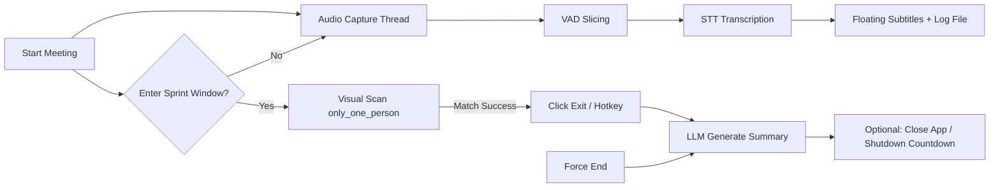

# Teams Auto-Assistant

**Teams Auto-Assistant** — In a Windows + Microsoft Teams environment, this tool provides background real-time Speech-to-Text, a floating subtitle display, visual recognition to automatically hang up when only one person remains, and generates intelligent meeting minutes.

---

## Features Overview

| Feature | Description |
|---------|-------------|
| **Real-time Speech-to-Text (STT)** | Background recording throughout the entire meeting, featuring low-latency slicing and silence detection. Calls an OpenAI-compatible STT service for real-time transcription |
| **Floating Subtitle Panel** | English glassmorphism floating window, top-most and semi-transparent. Features a typewriter effect with auto-scrolling, ensuring it does not block the main workspace |
| **Dual Audio Source Solution** | Supports either **Stereo Mix input devices** or **WASAPI Loopback**. Choose one based on your environment (no audio mixing performed) |
| **Low-Latency Audio Optimization** | Automatic mono + 16kHz resampling to reduce STT data volume and end-to-end latency |
| **Smart Visual Exit** | Captures screenshots within a Sprint time window to match the `only_one_person` template. **Confirms you are the only one left** before hanging up, preventing accidental clicks |
| **Smart Exit Action** | Prioritizes template matching to click the red "Leave" button; falls back to hotkeys if visual matching fails (`Alt+Shift+B` / `Ctrl+Shift+H`) |
| **LLM Meeting Minutes** | Automatically reads transcription logs after the meeting concludes to generate Markdown minutes (including Executive Summary / Discussion Points / Action Items) |
| **Force End** | Click **Force End & Summarize** at any time to bypass visual detection, manually terminate the session, and generate the meeting minutes |
| **Auto-Shutdown After Meeting (Optional)** | When checked, a 60-second countdown pops up after the summary is saved, allowing you to cancel or immediately shut down the PC |
| **OpenAI-compatible** | Both STT and LLM utilize the `openai` SDK. Simply change the `base_url` / `model` to switch between platforms like SiliconFlow, DeepSeek, etc. |

---

## Workflow



---

## Applicable Scenarios

- **Multinational IT regular meetings, stand-ups, project syncs** — requires full transcription and structured summaries
- **Late-night / cross-timezone meetings** — set the Sprint time window, automatically exit and generate the summary after the meeting concludes, with an optional auto-shutdown
- **Long meetings** — silent background recording and transcription, view subtitles in real-time via the floating window

---

## Quick Start

### Environment Requirements

- **Windows 10/11**
- **Python 3.10+** (3.11 recommended)
- **Microsoft Teams** desktop client
- STT / LLM service supporting OpenAI-compatible APIs (e.g., SiliconFlow)

### Installation

```bash
git clone https://github.com/SallyBruce/teams-auto-assistant.git
cd teams-auto-assistant/teams_assistant
pip install -r requirements.txt
```

### Configure API Key (Recommended)

```bash
# Copy the example config and fill in your real Keys
copy config.local.yaml.example config.local.yaml   # Windows
# cp config.local.yaml.example config.local.yaml  # macOS/Linux (Project is primarily for Windows)

# Edit config.local.yaml and fill in stt.api_key and llm.api_key
python main.py --config config.local.yaml
```

> `config.local.yaml` is ignored by `.gitignore` and will not be committed. The `config.yaml` in the repository only contains placeholders.

### Prepare Visual Templates (Required for Auto-Exit)

Place your screenshot templates (png/jpg/jpeg) in the `teams_assistant/assets/templates/` directory:

| Filename Contains | Purpose |
|-------------------|---------|
| `only_one_person` | **Trigger Template**: Identifies the interface state when "only I am left in the meeting" (crucial for preventing false hang-ups) |
| `exit_btn` | **Exit Template**: The red leave button, used to click and hang up after the trigger |

It is recommended to take these screenshots using your exact DPI scaling / Teams theme / language settings. You can place multiple templates with different resolutions; the program features built-in multi-scale matching (0.8~1.2).

### Run

```bash
cd teams_assistant
python main.py --config config.local.yaml
```

**CLI Parameters:**

```bash
python main.py --list-devices    # List audio input devices (to confirm device_index)
python main.py --self-test       # Minimal self-test (cross-day time window logic, etc.)
```

---

## Interface Description

Upon launch, an English floating control panel (CustomTkinter glassmorphism style) will appear:

1. **Transcript** — Real-time transcription subtitle area
2. **Audio Source** — Audio source selection (Stereo Mix / WASAPI Loopback)
3. **Sprint Window** — Visual monitoring time period (HH:MM, supports cross-day like 23:50 ~ 00:30)
4. **Shut down PC after summary** — Whether to shut down the PC after the current meeting ends
5. **Start Meeting** — Begin recording and transcription
6. **Force End & Summarize** — Manually end the session and generate the summary

---

## Output Files

Every time you click **Start Meeting**, the following will be generated in the `teams_assistant/` directory:

| File | Content |
|------|---------|
| `meeting_log_YYYYMMDD_HHMMSS.txt` | Complete transcription text |
| `Meeting_Summary_YYYYMMDD_HHMMSS.md` | LLM-structured meeting minutes |

---

## Project Structure

```
teams-auto-assistant/
├── README.md                 # This file (GitHub homepage)
├── Teams Auto.md             # Detailed product/technical documentation
└── teams_assistant/
    ├── main.py               # Entry point
    ├── config.yaml           # Default config (placeholder Keys)
    ├── config.local.yaml.example
    ├── requirements.txt
    ├── assets/templates/     # Visual templates (need to be prepared manually)
    ├── core/                 # Audio / STT / Visual / LLM modules
    └── ui/                   # Floating control panel
```

For more comprehensive architecture and configuration details, please refer to [Teams Auto.md](./Teams%20Auto.md) and [teams_assistant/README.md](./teams_assistant/README.md).

---

## Audio Source Selection Tips

- **Microphone / Stereo Mix**: Records via the input device; if you need to record both the remote end and your colleagues' voices simultaneously, you can enable Windows "Listen to this device" to play the microphone through your speakers (you will hear your own echo, but it will be recorded)
- **WASAPI Loopback**: Records pure system audio; requires PyAudio to support `as_loopback`, otherwise please switch to the Stereo Mix solution
- Run `python main.py --list-devices` to confirm your `audio.device_index`

---

## Tech Stack

`customtkinter` · `pyaudio` · `openai` · `pyautogui` · `opencv-python` · `pyyaml`

Multi-threading + Queue architecture. The main UI thread only polls for updates via `.after()` to prevent freezing and stuttering.

---

## Security Notes

- Please write your real API Keys only in `config.local.yaml` (which is gitignored)
- Do not commit local artifacts like `meeting_log_*.txt`, `Meeting_Summary_*.md`, `.wav`, etc.
- If a Key is accidentally leaked, please rotate the secret immediately in the corresponding platform's console

---

## License

MIT (Default MIT unless specified otherwise; can be modified as needed)
